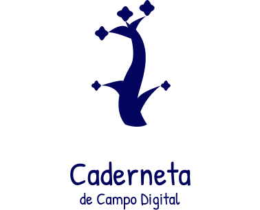

<!-- Logo -->
<div align="center">
    </img>
</div>

<br/>

<!-- Badges -->
<p align="center">
  <a href="https://codecov.io/gh/UnBArqDsw2021-2/2021.2_G4_CadernetaDeCampoDigital_Mobile">
    
  </a>
</p>

<!-- Repositórios/wiki -->
<p align="center">
	<a href="https://github.com/UnBArqDsw2021-2/2021.2_G4_CadernetaDeCampoDigital_Backend"><strong>Acesse a API</strong></a>
</p>
<p align="center">
	<a href="https://github.com/UnBArqDsw2021-2/2021.2_G4_CadernetaDeCampoDigital_docs"><strong>Acesse a nossa Wiki</strong></a>
</p>

<!-- Descrição sobre o Projeto -->
## Sobre

<p align="justify">&emsp;&emsp; Para incentivar as boas práticas agrícolas e de <a href=https://unbarqdsw2021-2.github.io/2021.2_G4_CadernetaDeCampoDigital_docs/requisitos/modelagem/lexicos/#rastreabilidade>rastreabilidade</a>, há a necessidade de uma aplicação que armazena os dados referentes a um produto agrícola para que se tenha a origem deste produto de maneira rastreável. Para rastrear esses produtos, necessita-se dos dados do <a href=https://unbarqdsw2021-2.github.io/2021.2_G4_CadernetaDeCampoDigital_docs/requisitos/modelagem/lexicos/#plantio>plantio</a> ou <a href=https://unbarqdsw2021-2.github.io/2021.2_G4_CadernetaDeCampoDigital_docs/requisitos/modelagem/lexicos/#cardeneta_de_campo>caderneta</a>, da <a href=https://unbarqdsw2021-2.github.io/2021.2_G4_CadernetaDeCampoDigital_docs/requisitos/modelagem/lexicos/#propriedade>propriedade</a> onde foi cultivado o produto, do produtor, da data de <a href=https://unbarqdsw2021-2.github.io/2021.2_G4_CadernetaDeCampoDigital_docs/requisitos/modelagem/lexicos/#plantio>plantio</a>/<a href=https://unbarqdsw2021-2.github.io/2021.2_G4_CadernetaDeCampoDigital_docs/requisitos/modelagem/lexicos/#colher_plantio>colheita</a>, dos produtos ou <a href=https://unbarqdsw2021-2.github.io/2021.2_G4_CadernetaDeCampoDigital_docs/requisitos/modelagem/lexicos/#agrotoxico>agrotóxicos</a> aplicados, do nome da <a href=https://unbarqdsw2021-2.github.io/2021.2_G4_CadernetaDeCampoDigital_docs/requisitos/modelagem/lexicos/#cultura>cultura</a> e do <a href=https://unbarqdsw2021-2.github.io/2021.2_G4_CadernetaDeCampoDigital_docs/requisitos/modelagem/lexicos/#talhao>talhão</a> onde foi cultivado.</p>
<p align="justify">&emsp;&emsp; Os dados da <a href=https://unbarqdsw2021-2.github.io/2021.2_G4_CadernetaDeCampoDigital_docs/requisitos/modelagem/lexicos/#cardeneta_de_campo>caderneta</a> ou <a href=https://unbarqdsw2021-2.github.io/2021.2_G4_CadernetaDeCampoDigital_docs/requisitos/modelagem/lexicos/#plantio>plantio</a> são de extrema importância pois nele estão contidas informações cruciais como o produto que foi plantado, onde foi plantado, quais produtos foram aplicados e as datas tanto de <a href=https://unbarqdsw2021-2.github.io/2021.2_G4_CadernetaDeCampoDigital_docs/requisitos/modelagem/lexicos/#plantio>plantio</a> quanto de <a href=https://unbarqdsw2021-2.github.io/2021.2_G4_CadernetaDeCampoDigital_docs/requisitos/modelagem/lexicos/#colher_plantio>colheita</a>, tornando-se o elemento mais rastreável para referenciar a origem de um produto. Dessa forma, a aplicação busca suprir as necessidades expostas por essa demanda real, de forma simples e viável tanto para os <a href=https://unbarqdsw2021-2.github.io/2021.2_G4_CadernetaDeCampoDigital_docs/requisitos/modelagem/lexicos/#produtor>produtores</a> quando para os <a href=https://unbarqdsw2021-2.github.io/2021.2_G4_CadernetaDeCampoDigital_docs/requisitos/modelagem/lexicos/#tecnico>técnicos</a> que estarão utilizando esse aplicativo.</p>

**Código da Disciplina**: FGA0208<br>
**Número do Grupo**: 04<br>

## Alunos

| Matrícula  | Aluno                            |
| ---------- | -------------------------------- |
| 19/0025379 | Brenno Oliveira Silva            |
| 19/0056843 | Carlos Eduardo de Sousa Fiuza    |
| 17/0161871 | Denniel William Roriz Lima       |
| 19/0012307 | Eduardo Afonso Dutra Silva       |
| 19/0030879 | João Pedro Moura Oliveira        |
| 19/0047968 | Paulo Vitor Silva Abi-Acl        |
| 19/0019085 | Rafael Cleydson da Silva Ramos   |
| 19/0020377 | Thiago Sampaio de Paiva          |
| 19/0044403 | Victor Souza Dantas Martins Lima |
| 19/0020903 | Vitor Magalhães Lamego           |


<!-- Instalação -->
## Instalação
### O Projeto está rodando?

(X) SIM
() NÃO

<!-- Pré-Requisitos -->
### Pré-Requisitos
#### Obrigatórios
|Tecnologias|Descrição|
|-|-|
|[Git](https://git-scm.com/)|`git` é uma ferramenta de versionamento de código `gratuito` e `open source`, capaz de lidar com tudo desde pequenos até grandes projetos, com `velocidade` e `eficiência`.|
|[Flutter](https://flutter.dev/docs/get-started/install)| `flutter` é UI toolkit da Google de criação de bonitas aplicações compiladas nativamente, em mobile, web e desktop, de um simples código base, em linguagem `dart`.|


<!-- Frontend -->
### Baixando e rodando o Frontend Mobile
```bash
# Clone o Frontend
$ git clone https://github.com/UnBArqDsw2021-2/2021.2_G4_CadernetaDeCampoDigital_Mobile
# Entre na pasta do projeto
$ cd 2021.2_G4_CadernetaDeCampoDigital_Mobile
# Rodando o Flutter
$ flutter run
```
